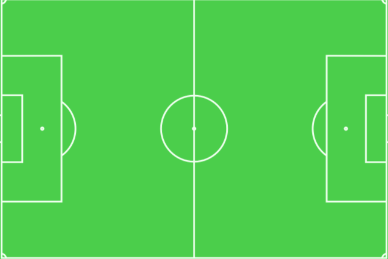

# ⚽ xGoals – Expected Goals (xG) Model with StatBomb OpenData

Welcome to **xGoals**, a project designed to train an **Expected Goals (xG)** model using [StatBomb OpenData](https://github.com/statsbomb/open-data) and apply it to your own matches. You can even record shot events manually through a custom graphical interface. Ideal for performance analysis and Tableau visualizations 📊.

---

## 🚀 Features

- Train an xG model using `XGBClassifier`.
- Collect shot data using a custom graphical user interface (GUI).
- Apply your trained model to new data.
- Export clean CSV files ready for Tableau.
- Visualization-ready data with field map images for further insights.

---

## 🗂️ Project Structure

```
ChatGPT_xG/
│
├── models/                  # Trained model (.pkl)
│   └── xg_shot.pkl
│
├── output/                  # Generated outputs
│   ├── events.csv
│   ├── events_with_xG.csv
│   └── csv/
│       ├── shots_9880.csv
│       ├── pass_9880.csv
│       └── complete_matches.csv
│
├── src/                     # Core source code
│   ├── competition_matches.py
│   ├── export_id_names.py
│   ├── get_xG.py
│   ├── model_optimization.ipynb
│   ├── shot_data.py
│   ├── shot_data_collector.py
│   └── train_model.py
│
├── utils/                   # Auxiliary resources
│   ├── id_name_mappings.xlsx
│   ├── soccer_field.png
│   └── soccer_field_transparent.png
```

---

## 📦 Requirements

- Python **3.13.2**
- Install dependencies:

```bash
pip install -r requirements.txt
```

> ⚠️ If `requirements.txt` is missing, manually install:
> `xgboost`, `pandas`, `numpy`, `scikit-learn`, `matplotlib`, `seaborn`, `tkinter` (usually pre-installed)

---

## 📥 Initial Setup

1. **Clone this repository**:

```bash
git clone https://github.com/RGB-420/xGoals.git
cd xGoals
```

2. **Download StatBomb Open Data**  
   Get the full dataset from:  
   👉 https://github.com/statsbomb/open-data  
   and place the folder inside the project directory as: `open-data`

3. **Run the scripts to prepare the data:**

```bash
# Extract match information
python src/competition_matches.py

# Generate CSVs for shots and passes
python src/shot_data.py

# Train the xG model
python src/train_model.py
```

---

## 🧠 Using the xG Model

Once the model is trained, apply it to any shot dataset:

```bash
python src/get_xG.py
```

This will generate files such as `events_with_xG.csv` in the `output/` folder.

---

## 🎯 Manual Shot Collection (Built-in GUI)

To collect shot data from custom matches using the GUI:

```bash
python src/shot_data_collector.py
```

Field interaction:

- Left click → set shot location
- Middle click → set goalkeeper location
- Right click → set key pass location
- Then click `Add Event` and finally `Save CSV`.

🖼️ Preview:



---

## 📊 Tableau Visualization

The file `utils/soccer_field_transparente.png` is specifically designed to be used as a background image in Tableau dashboards. It aligns with the coordinate system used in the exported shot data.


The generated CSVs (`complete_matches.csv`, `events_with_xG.csv`, etc.) are formatted and ready to be used in **Tableau** dashboards for advanced performance analysis.

---

## 🤝 Contributing

Contributions are welcome! Feel free to open issues, suggestions, or pull requests.

---

## 📜 License

This project currently has **no license defined**. You are encouraged to add one (MIT, GPL, etc.).

---

## 📬 Contact

Developed by [RGB-420](https://github.com/RGB-420)  
For support or questions, feel free to open an issue.

---


---

## 📚 Data Source

This project uses publicly available football event data from [StatsBomb Open Data](https://github.com/statsbomb/open-data), licensed under [CC BY 4.0](https://creativecommons.org/licenses/by/4.0/).

